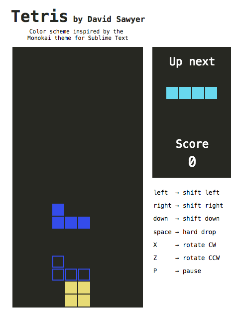

tetris
======

tetris in javascript

build instructions
------------------

This project uses Grunt, so after cloning this repo you will need to run an `npm install` and then `grunt` in the `tetris` directory to get going.

If you don't have [Grunt](http://gruntjs.com/) or [node.js](http://nodejs.org/), check out their websites for installation instructions.

